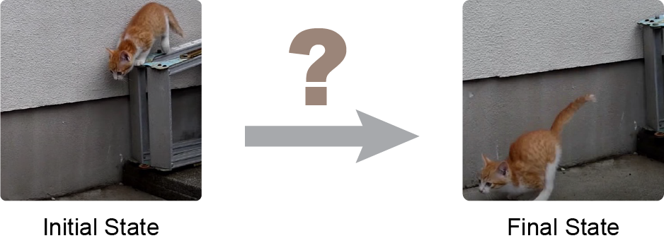
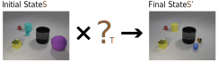
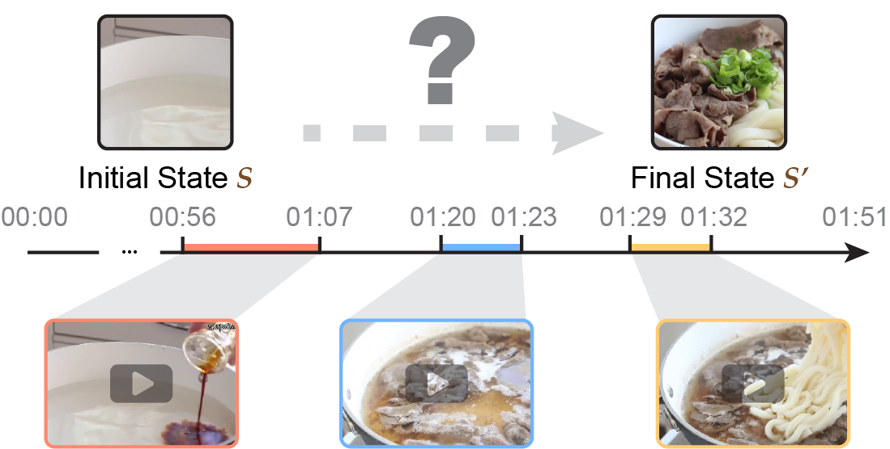
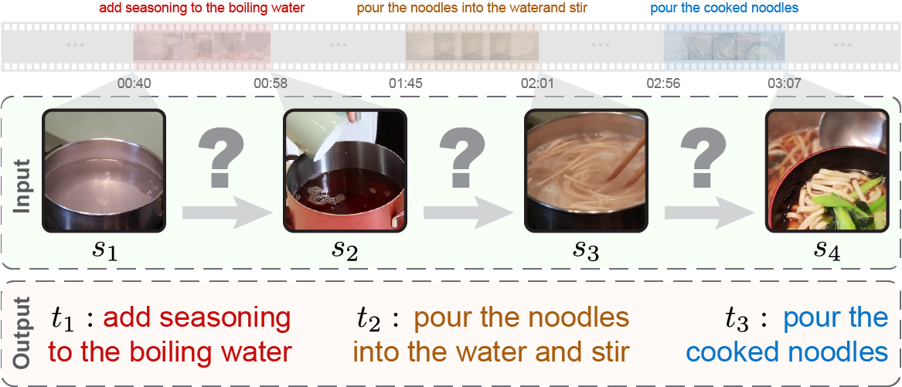

# VTR - Visual Transformation Reasoning

This repository contains the official source code of serveral projects about visual transformation reasoning (VTR). 

<center>
    
</center>

Visual reasoning tasks mainly focus on static states and lack the ability to characterize or evaluate understanding of the fundamental aspect of the human world — "transformation." However, understanding transformation, a basic ability of human, is an essential path towards general artificial intelligence. To fill this gap, we propose the problem of visual transformation reasoning, aiming to investigate how machines can understand transformations. Given a set of images representing states, the objective is to infer the transformation or the sequence of atomic transformations that occurred between states.

---

<br>

## TVR (CVPR 2021)



*Given the initial state and the final state, the target is to infer the intermediate transformation.*

> **Transformation driven Visual Reasoning** <br>
> Xin Hong, Yanyan Lan, Liang Pang, Jiafeng Guo, Xueqi Cheng <br>
> *Published on 2021 IEEE/CVF Conference on Computer Vision and Pattern Recognition (CVPR)*

[](https://hongxin2019.github.io/TVR/)
[](https://hongxin2019.github.io/TVR/dataset)
[](https://arxiv.org/pdf/2011.13160.pdf)

``` bibtex
@inproceedings{hongTVR2021,
  title = {Transformation {{Driven Visual Reasoning}}},
  booktitle = {2021 {{IEEE}}/{{CVF Conference}} on {{Computer Vision}} and {{Pattern Recognition}} ({{CVPR}})},
  author = {Hong, Xin and Lan, Yanyan and Pang, Liang and Guo, Jiafeng and Cheng, Xueqi},
  year = {2021},
  pages = {6899--6908}
}
```

---

<br>


## TRANCO (TPAMI 2023)



*Given initial and final state images, the task requires retrieving a sequence of video clips representing changes between states from a candidate set.*

> **Visual Reasoning: From State to Transformation** <br>
> Xin Hong, Yanyan Lan, Liang Pang, Jiafeng Guo, Xueqi Cheng <br>
> *Accepted by IEEE Transactions on Pattern Analysis and Machine Intelligence*

[](https://arxiv.org/pdf/2305.01668.pdf)


``` bibtex
@article{hongTRANCO2023,
  author={Hong, Xin and Lan, Yanyan and Pang, Liang and Guo, Jiafeng and Cheng, Xueqi},
  journal={IEEE Transactions on Pattern Analysis and Machine Intelligence}, 
  title={Visual Reasoning: From State to Transformation}, 
  year={2023},
  pages={1-13},
  doi={10.1109/TPAMI.2023.3268093}}
```

---
<br>

## VTT



> **Visual Transformation Telling** <br>
> Xin Hong, Yanyan Lan, Liang Pang, Jiafeng Guo, Xueqi Cheng <br>
> under review 

*Given a set of ordered state images, the task requires describing all transformations that occur between adjacent states.*

[](https://arxiv.org/pdf/2305.01928.pdf)


``` bibtex
@misc{hongVTT2023,
      title={Visual Transformation Telling}, 
      author = {Hong, Xin and Lan, Yanyan and Pang, Liang and Guo, Jiafeng and Cheng, Xueqi},
      year={2023},
      eprint={2305.01928},
      archivePrefix={arXiv},
      primaryClass={cs.CV}
}
```


## LICENSE

The code is licensed under the [MIT license](./LICENSE).